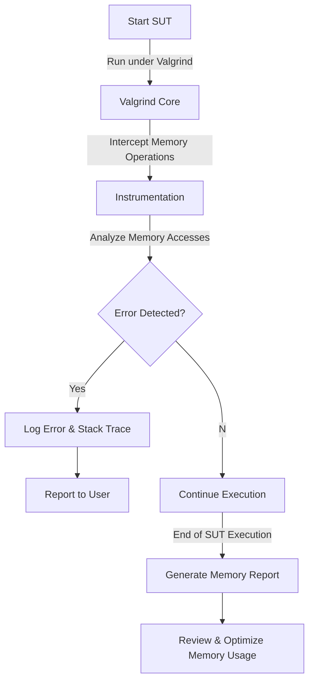

# Memory Profiling with Valgrind

## How Valgrind Works

Valgrind is a dynamic analysis tool that translates machine code into an instrumented version before execution. This enables it to track memory usage without requiring modifications to the target program. It runs the system under test (SUT), capturing each instruction and applying various checks based on the selected tool.

Valgrind's core functions include:
- Detecting memory errors.
- Profiling memory usage.
- Simulating program execution with additional monitoring.

Valgrind includes multiple tools, with **Memcheck** and **Massif** being the most widely used for memory analysis.

## Memory Profiling with Valgrind

### Memcheck: Detecting Memory Issues
Memcheck monitors memory access and allocation in real-time, identifying:
- Access to uninitialized memory.
- Use of memory after it has been freed.
- Out-of-bounds memory access.
- Memory leaks.

Memcheck maintains shadow memory, which stores metadata about the validity and initialization state of memory regions. When an invalid operation occurs, Valgrind reports an error and provides details to help diagnose the issue.

To use Memcheck, run:
```bash
valgrind --tool=memcheck SUT
```

### Massif: Heap and Stack Profiling
Massif records memory allocation over time to help examine memory usage patterns. It captures snapshots and tracks peak memory usage, which can aid in optimizing memory consumption.

Massif monitors:
- Heap memory usage.
- Stack size (optional).
- Allocation peaks and trends.

To use Massif, run:
```bash
valgrind --tool=massif SUT
```
After execution, the memory profile is saved in `massif.out.<pid>`, which can be examined using:
```bash
ms_print massif.out.<pid>
```

### Determining Minimum Memory Requirements
Valgrind can help determine the minimum memory the SUT requires by tracking peak memory consumption. Using Massif, developers can:
- Identify unnecessary memory use.
- Adjust memory allocation strategies.
- Ensure efficient use of system resources.

To determine minimum memory needs:
1. Run the SUT with Massif.
2. Review the peak memory usage reported.

## Valgrind Memory Profiling Workflow Diagram


By using Valgrind’s tools, memory-related problems can be identified and addressed, improving SUT performance and stability.


