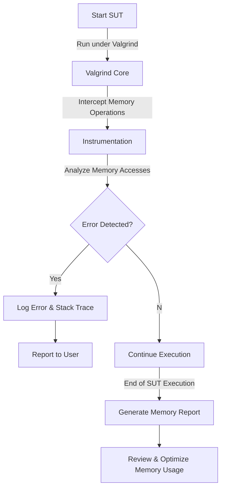

# Memory Profiling with Valgrind

## Overview

Valgrind operates as a layer between the system under test (SUT) and the operating system. Instead of executing the SUT directly on the CPU, Valgrind provides a synthetic CPU that runs the program in a controlled environment. Before execution, Valgrind passes the program through a tool of choice, modifying its code by embedding additional instructions required for analysis. These tools intercept system calls, record memory operations, and monitor execution behavior at a low level.

Valgrind achieves this through **Dynamic Binary Instrumentation (DBI)** and **Just-In-Time (JIT) compilation**, which injects monitoring code into the SUT at runtime. This allows for tracking memory allocations, detecting invalid accesses, and profiling performance metrics.

### Architecture

Valgrind consists of two main layers:
- **Core Engine**: Loads the SUT, disassembles its code, and manages execution within the synthetic CPU.
- **Tool Plugins**: Apply different types of instrumentation and analysis before handing execution back to the core engine.

Several built-in tools extend Valgrind’s functionality:
- **Memcheck** – Detects memory errors and leaks.
- **Helgrind** – Identifies threading issues like race conditions and deadlocks.
- **Cachegrind** – Analyzes CPU cache efficiency and branch prediction.
- **Massif** – Profiles heap memory usage.

Custom tools can also be developed for specialized analysis.

## Memory Profiling with Valgrind

### Memcheck: Detecting Memory Issues
Memcheck monitors memory access and allocation, identifying:
- Access to uninitialized memory.
- Use of memory after it has been freed.
- Out-of-bounds memory access.
- Memory leaks.

Memcheck assigns each allocated block a corresponding shadow block that tracks memory state. When the `free` function is called, Memcheck verifies whether the memory was properly allocated and reports errors for invalid accesses.

To use Memcheck, run:
```sh
valgrind --tool=memcheck SUT
```

### Massif: Heap and Stack Profiling
Massif tracks heap and optional stack allocations over time. It helps analyze memory usage trends and identify excessive consumption.

Massif records:
- Heap memory usage.
- Stack size (optional).
- Peak memory allocation events.

To use Massif, run:
```sh
valgrind --tool=massif SUT
```
After execution, memory profiling results are stored in `massif.out.<pid>`, which can be examined using:
```sh
ms_print massif.out.<pid>
```

### Determining Minimum Memory Requirements
Valgrind helps estimate the minimum memory required for execution by tracking peak memory consumption. Using Massif, developers can:
- Identify excessive memory usage.
- Optimize memory allocation.
- Ensure efficient resource utilization.

Steps to determine minimum memory requirements:
1. Run the SUT with Massif.
2. Analyze peak memory usage from the generated report.

## Valgrind Memory Profiling Workflow Diagram


Valgrind’s ability to run unmodified executables in a controlled environment makes it a powerful tool for memory profiling, debugging, and optimization.

