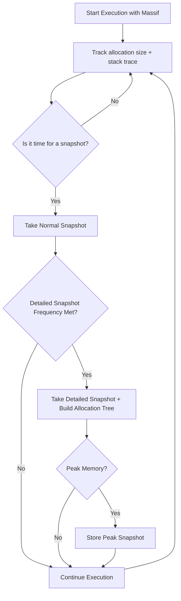

# Memory Profiling with Valgrind Massif

Valgrind's Massif tool is a heap profiler used for analyzing dynamic memory allocations (heap). 


## How to Run Massif

To profile a compiled executable (no source code needed):

```bash
valgrind --tool=massif ./SUT
```

After the run, Massif will output a file such as `massif.out.<pid>`.

To visualize the results:

```bash
ms_print massif.out.<pid>
```


## How does Valgrind (massif) determine memory usage of an executable?
Massif intercepts heap allocation functions (e.g., `malloc`, `calloc`, `realloc`, `new`, `new[]`) and tracks the number of bytes requested and actually allocated (including metadata and alignment overhead). These allocations are traced back through the call stack to build a complete picture of memory usage.


## How does it keep track of what memory is in use?
Massif maintains a live tree (`XTree`) of active allocations, where each allocation is tagged with the execution context (a stack trace). On every allocation and deallocation, Massif updates this tree. It uses "snapshots" to capture the current memory state at different execution points.


## How does it keep track of what type of memory is used frequently?
Massif’s detailed snapshots include allocation trees that show where allocations happen and how much memory each site consumes. By default, every 10th snapshot is detailed. The tree nodes aggregate memory usage by code location, making it easy to identify frequently used allocation types (e.g., small blocks vs. large pages).

Example command:
```bash
valgrind --tool=massif --detailed-freq=1 ./SUT
```


## How does it determine which type of memory is used the most for an executable?
Massif builds a heap tree from detailed snapshots, summing allocations from all code locations. The snapshot at peak memory usage shows which functions or call sites contributed most to the total usage.

Example command:
```bash
valgrind --tool=massif --pages-as-heap=yes ./SUT
```


## How does Valgrind keep track of path coverage?
Massif doesn’t directly track code path coverage. Instead, it records the stack trace of each allocation, effectively showing which code paths led to heap usage. This acts as a proxy for coverage in terms of memory behavior.

Example command:
```bash
valgrind --tool=massif --xtree-memory=yes ./SUT
```


## Flowchart: How Massif Works




## Some massif Parameters

- **Heap only (default):**
  ```bash
  valgrind --tool=massif ./SUT
  ```

- **Include stacks:**
  ```bash
  valgrind --tool=massif --stacks=yes ./SUT
  ```

- **Use time based on memory bytes:**
  ```bash
  valgrind --tool=massif --time-unit=B ./SUT
  ```

- **Track all memory, including mmap'd pages:**
  ```bash
  valgrind --tool=massif --pages-as-heap=yes ./SUT
  ```

- **Set snapshot details:**
  ```bash
  valgrind --tool=massif --detailed-freq=1 --max-snapshots=200 ./SUT
  ```

- **Run ms_print:**
  ```bash
  ms_print massif.out.<pid>
  ```


NB: For large programs or to visualize the memory usage graphically, consider using:

```bash
massif-visualizer massif.out.<pid>
```


