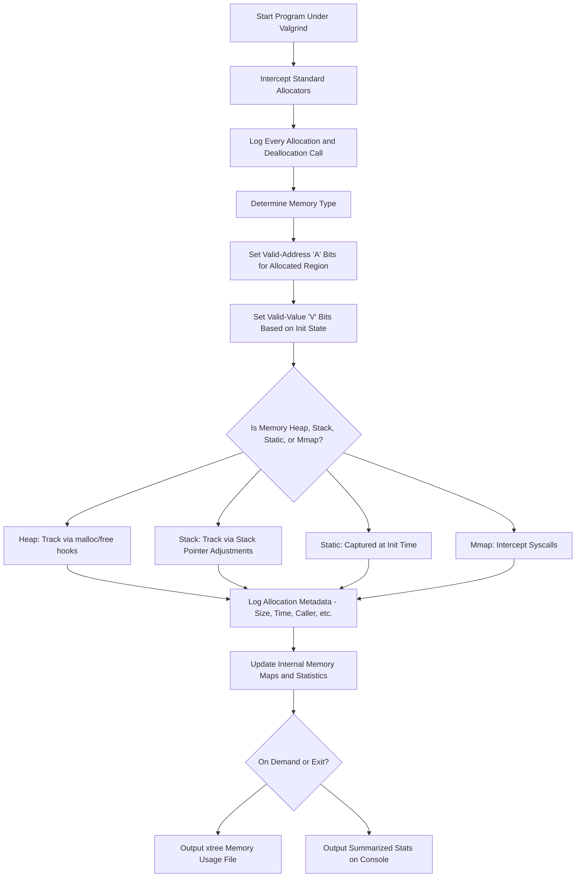

# Valgrind Memcheck: Memory Usage Profiling Only

## How Valgrind Determines Memory Usage

Valgrind's **Memcheck** tool supports memory profiling by monitoring every memory allocation and deallocation during runtime. This subsection is focused on understanding **how much memory an executable uses**, **what type of memory is used**, and **how frequently each type is allocated**.

Memcheck does not merely detect errors. For profiling purposes, it records and categorizes memory blocks, tracks allocation sizes and lifetimes, and optionally outputs this data as execution trees for detailed inspection.

Memcheck enables **execution-tree-based memory usage tracking** using:

```bash
valgrind --tool=memcheck --xtree-memory=full ./SUT
```

This generates a detailed memory usage tree (`xtmemory.kcg.PID`) that can be visualized in tools like `kcachegrind`.

---

## Memory Types and How Valgrind Tracks Them

| Memory Type        | Description                                          | Tracking Method                                           |
|--------------------|------------------------------------------------------|------------------------------------------------------------|
| Heap               | Dynamic memory from malloc/new                       | Intercepts malloc/calloc/new and logs size and frequency  |
| Stack              | Function-local allocations                          | Tracks SP (stack pointer) movements to calculate usage     |
| Global/Static      | Predefined global/static buffers                     | Captured during initialization                            |
| Mmap/Anonymous     | Memory mapped with `mmap`                            | Intercepts system calls and tracks size and usage         |
| Redzones           | Guard regions around allocations                    | Accounted for in total usage, tracked per allocation       |

Valgrind distinguishes memory usage patterns based on frequency and size. To detect **which type is used the most**, it counts the number of allocations and total bytes allocated per type across the lifetime of the process.

---

## How Valgrind Tracks Memory Usage Internally



---

## Commands for Memory Usage Profiling

### 1. Full Memory Usage Summary:
```bash
valgrind --tool=memcheck --xtree-memory=full ./SUT
```
Outputs memory usage data to `xtmemory.kcg.PID`, viewable with `kcachegrind`.

### 2. Heap Profiling (Leaked, Live, Reachable):
```bash
valgrind --tool=memcheck --leak-check=full --show-leak-kinds=all ./SUT
```

### 3. Track Memory Origin (for profiling dynamic vs static vs stack):
```bash
valgrind --tool=memcheck --track-origins=yes ./SUT
```

### 4. Count Allocation Frequency:
Use execution trees to inspect frequent allocators:
```bash
valgrind --tool=memcheck --xtree-memory=full ./SUT
kcachegrind xtmemory.kcg.PID
```

---

## Memory Profiling Breakdown

### How much memory an executable uses:
Valgrind tracks memory usage by intercepting all memory-related functions such as `malloc`, `calloc`, `realloc`, `mmap`, and their deallocation counterparts. It records the size and location of each allocation and maintains a running total of all active memory. When the program ends or at defined checkpoints, Valgrind summarizes the total allocated, still-live, and peak memory usage. These metrics help you understand the footprint of your program in terms of total memory consumption.
```bash
valgrind --tool=memcheck --xtree-memory=full ./SUT
```

### What type of memory is used:
Valgrind distinguishes memory types by analyzing the origin of each allocation. Heap memory is logged through dynamic allocators, stack usage is inferred from stack pointer changes, static and global memory is captured during program startup, and memory-mapped regions are monitored through system calls. This classification is maintained in Valgrind’s internal metadata to provide a type-based breakdown.
```bash
valgrind --tool=memcheck --track-origins=yes ./SUT
```

### How frequently each type is allocated:
Allocation frequency is measured by maintaining per-type counters, logging each allocation and deallocation as it occurs. This data is then aggregated and tied to the call stack to highlight which memory types and code paths are allocating most frequently. Visualization through execution trees helps reveal allocation hotspots.
```bash
valgrind --tool=memcheck --xtree-memory=full ./SUT
kcachegrind xtmemory.kcg.PID
```

---

## Summary: 

- Every allocated block is tagged with its **type** (heap, stack, etc).
- Sizes, locations, and lifetimes are recorded.
- At exit or during execution, Valgrind can output:
  - Total memory used per type
  - Allocation frequency per type
  - Live vs leaked vs reachable memory
- Execution trees visualize the **hot paths** of memory allocation.

Memcheck is highly effective for memory usage profiling when combined with `--xtree-memory`, allowing fine-grained inspection of how much memory your program uses, and which parts of code are responsible for the highest memory demand.

