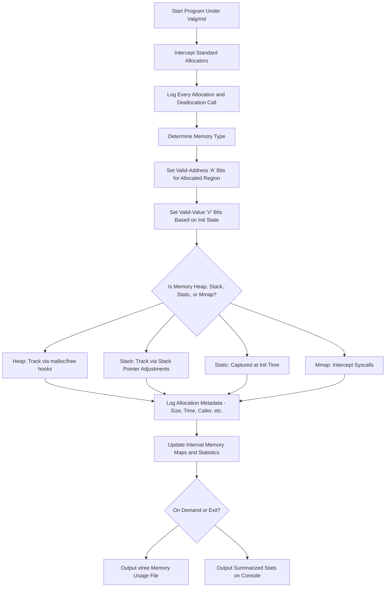

# Valgrind Memcheck: Memory Usage Profiling Only

## How Valgrind Determines Memory Usage

Valgrind's **Memcheck** tool supports memory profiling by monitoring every memory allocation and deallocation during runtime. This subsection is focused on understanding **how much memory an executable uses**, **what type of memory is used**, and **how frequently each type is allocated**.

Memcheck does not merely detect errors. For profiling purposes, it records and categorizes memory blocks, tracks allocation sizes and lifetimes, and optionally outputs this data as execution trees for detailed inspection.

Memcheck enables **execution-tree-based memory usage tracking** using:

```bash
valgrind --tool=memcheck --xtree-memory=full ./your_executable
```

This generates a detailed memory usage tree (`xtmemory.kcg.PID`) that can be visualized in tools like `kcachegrind`.

---

## Memory Types and How Valgrind Tracks Them

| Memory Type        | Description                                          | Tracking Method                                           |
|--------------------|------------------------------------------------------|------------------------------------------------------------|
| Heap               | Dynamic memory from malloc/new                       | Intercepts malloc/calloc/new and logs size and frequency  |
| Stack              | Function-local allocations                          | Tracks SP (stack pointer) movements to calculate usage     |
| Global/Static      | Predefined global/static buffers                     | Captured during initialization                            |
| Mmap/Anonymous     | Memory mapped with `mmap`                            | Intercepts system calls and tracks size and usage         |
| Redzones           | Guard regions around allocations                    | Accounted for in total usage, tracked per allocation       |

Valgrind distinguishes memory usage patterns based on frequency and size. To detect **which type is used the most**, it counts the number of allocations and total bytes allocated per type across the lifetime of the process.

---

## How Valgrind Tracks Memory Usage Internally



---

## Commands for Memory Usage Profiling

### 1. Full Memory Usage Summary:
```bash
valgrind --tool=memcheck --xtree-memory=full ./your_executable
```
Outputs memory usage data to `xtmemory.kcg.PID`, viewable with `kcachegrind`.

### 2. Heap Profiling (Leaked, Live, Reachable):
```bash
valgrind --tool=memcheck --leak-check=full --show-leak-kinds=all ./your_executable
```

### 3. Track Memory Origin (for profiling dynamic vs static vs stack):
```bash
valgrind --tool=memcheck --track-origins=yes ./your_executable
```

### 4. Count Allocation Frequency:
Use execution trees to inspect frequent allocators:
```bash
valgrind --tool=memcheck --xtree-memory=full ./your_executable
kcachegrind xtmemory.kcg.PID
```

---

## Summary: Profiling Logic

- Every allocated block is tagged with its **type** (heap, stack, etc).
- Sizes, locations, and lifetimes are recorded.
- At exit or during execution, Valgrind can output:
  - Total memory used per type
  - Allocation frequency per type
  - Live vs leaked vs reachable memory
- Execution trees visualize the **hot paths** of memory allocation.

Memcheck is highly effective for memory usage profiling when combined with `--xtree-memory`, allowing fine-grained inspection of how much memory your program uses, and which parts of code are responsible for the highest memory demand.

